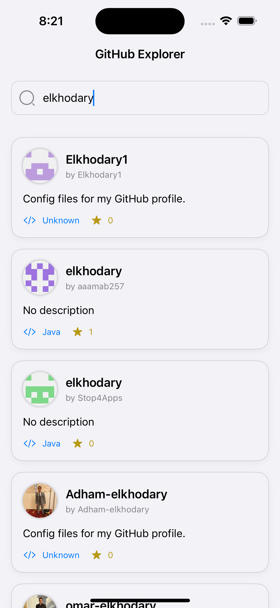
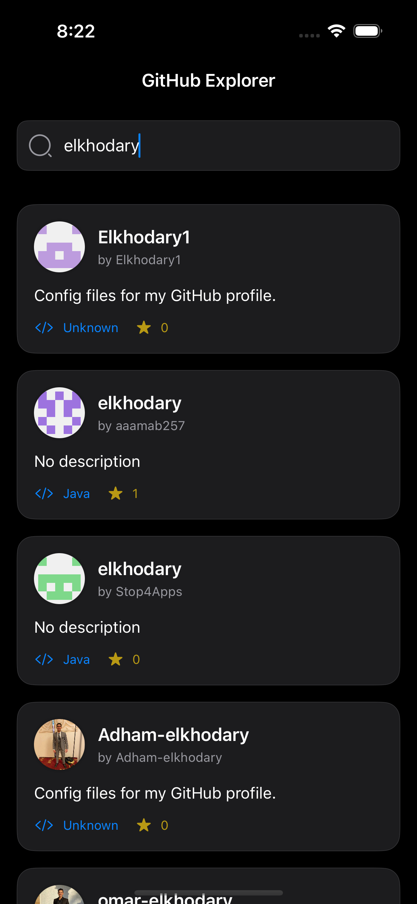

# 🌦️ RepoFinder (Clean Architecture + MVVM)

<p align="center">
  
</p>

<p align="center" style="display: flex; gap: 10px;">


</p>

## 🌟 Overview

**RepoFinderApp** is a modern iOS application built with:
- **SwiftUI** for declarative UI
- **Clean Architecture** for maintainability
- **MVVM** pattern with Combine and async

Key highlights:

✅ Protocol-oriented networking layer  

✅ Dependency injection for testability 

✅ This architecture helps in maintaining a scalable and testable codebase.

## 🎯 Features

### 🏗️ Architecture
- **Clean Architecture** with clear separation of:
  - Presentation (SwiftUI with MVVM) = ViewModels + Views
  - Domain (Entities & Use Cases & Repositories Interfaces) 
  - Data (Repositories & API)
- **MVVM** pattern with `ObservableObject` ViewModels
- **Dependency Injection** using Factory

### 🔍 GitHub Explorer – App Functionality
- 🔎 Repository Search
- 📋 Repository Display
- 🕵️ Smart Empty States
- ⚠️ Error Handling
- 💡 Dark & Light Mode Support
- 📱 Modern UI

### 🧪 Testing
- Mock implementations for all services
- Isolated ViewModel tests
- Network layer protocol testing


## Installation

1. Clone the repository:
    ```bash
    git clone https://github.com/AbdelrahmanElKhodary114/RepoFinder.git
    ```
2. Open the project in Xcode:
    ```bash
    open RepoFinder.xcodeproj
    ```
3. Build and run the application.

## Contributing

Feel free to open issues or submit pull requests. Please ensure your code adheres to the project's coding standards and includes appropriate tests.
